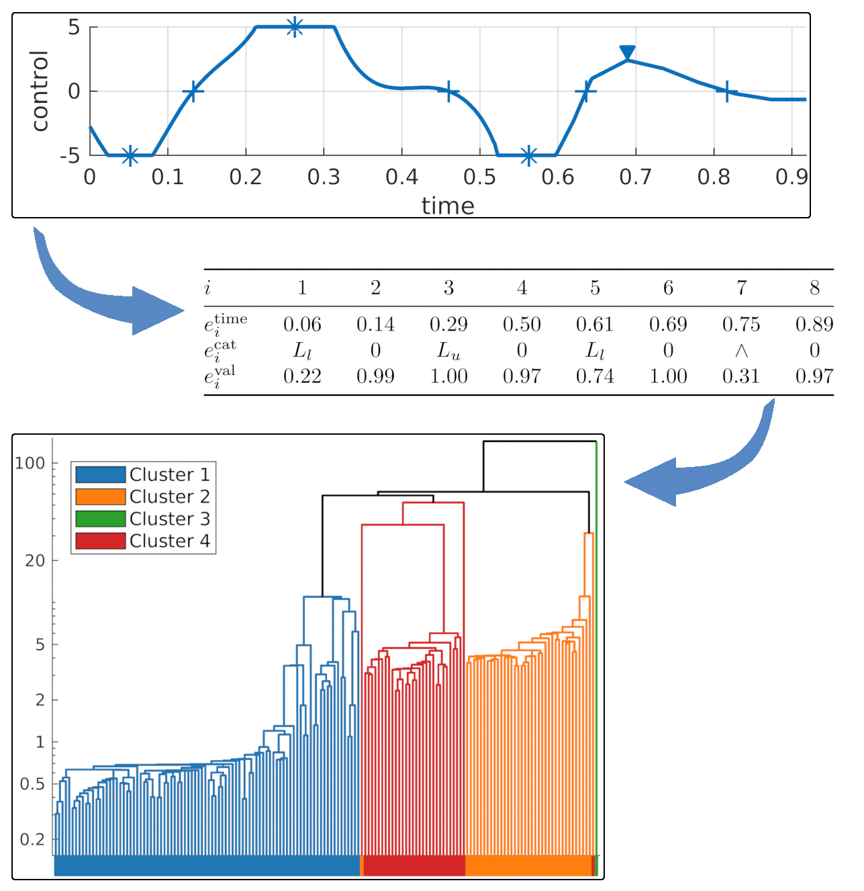

# Feature-based Trajectory Clustering 

This repository contains an implementation of the feature-based trajectory clustering algorithm that is presented at Humanoids 2023. 


Many clustering algorithms for trajectories build upon distance metrics that are based on pointwise Euclidean distances. However, focusing on salient characteristics is often sufficient. The feature-based trajectory clustering relies on a novel distance measure for motion plans consisting of state and control trajectories that is based on a compressed representation built from their main features. This approach allows a flexible choice of feature classes relevant to the respective task. The distance measure is used in agglomerative hierarchical clustering. The method is compared with the widely used dynamic time warping algorithm on test sets of motion plans for the Furuta pendulum and the Manutec r3 robot arm and on real-world data from a human motion dataset.

*Disclaimer:* The code in this repository is considered research and "experimental".



## Installation

### Dependencies 

The code has been written in Linux and requires the GNU compiler for C++ and MATLAB.

#### C++-specific dependencies: 

The required [Eigen 3.4.0](https://gitlab.com/libeigen/eigen/-/releases/3.4.0) headers and two files from the [LodePNG](https://lodev.org/lodepng/) library  are included in the code from this repository.
- CMake (version 2.8 or higher)
- Boost (version 1.46.0: serialization, filesystem)

#### MATLAB-specific dependencies: 

- Signal Processing Toolbox
- Statistics and Machine Learning Toolbox

The following MATLAB packages are downloaded automatically from the respective Github repository when `init()` is called the first time:
- export_fig (https://github.com/altmany/export_fig)
- fig2svg (https://github.com/kupiqu/fig2svg)
- cmap (https://github.com/tsipkens/cmap)
- iosr (https://github.com/IoSR-Surrey/MatlabToolbox)


### Compile libraries and prepare MATLAB environment 

#### 1. Compile the C++ libraries 

Cd into the folder *cppsrc* and execute the following steps:

    mkdir build
    cd build
    cmake ..
    make
    cd ..


#### 2. Initialize the MATLAB environment 

Cd into the folder *matlabsrc* and start MATLAB using `start_matlab.sh`. This script automatically preloads the system's libstdc++.so.6 library to avoid the use of MATLAB's old version of this library which may cause errors when the mex-files are called (see [here](https://de.mathworks.com/matlabcentral/answers/1907290-how-to-manually-select-the-libstdc-library-to-use-to-resolve-a-version-glibcxx_-not-found) for more details).

Call

    init();

in MATLAB. This will
- add all (sub-)folders to the MATLAB path
- download the required MATLAB packages from Github if not downloaded before
- compile all mex-files that have not been compiled before


## Overview

The folder cppsrc contains the source files needed to build the libraries that are used by the mex-files in the MATLAB environment.
It containts the following subfolders:
- models: the optimal control problems for the Furuta pendulum and the Manutec r3 robot arm including the system dynamic that have been used to compute the motion plans to be clustered
- functionReimplement: the spline functions used to represent the motion plans
- util: utility functions, most importantly, the implementation of Elzinga's *Grid* algorithm to measure the distances of sequences ([Elzinga: Sociological Methods & Research (2003)](https://doi.org/10.1177/004912410325337), [Elzinga and Wang: Theoretical Computer Science (2013)](https://doi.org/10.1016/j.tcs.2013.06.006) and [Elzinga and Studer: Sociological Methods & Research (2015)](https://doi.org/10.1177/0049124114540707))
- matlab_interface: the source files to be compiled into MATLAB mex files
- dlc, math, serialization: some more code
- external: code of the external libraries

The folder matlabsrc contains the MATLAB code which is used to generate the results.


## Usage 

The scripts used for the Paper are located in matlabsrc/scripts and can be used to reproduce the presented results.

### The Feature-based Trajectory Distance Measure

#### Scripts to reproduce the paper results
- The main scripts used to compute the results presented in the paper are
  - clustering_furuta.m
  - clustering_manutec.m
  - clustering_humanMotion_dataset.m
- The script *clustering_evaluation_times.m* is used to process and present the runtime information collected in `clusterOCPSolution`. 


#### TrajCharTable

- This is a class to construct the sequence-based representations of trajectories.
- The desired feature classes must be added using `addTrajChar` which expects a feature class object. Feature classes are represented by classes inheriting from  `TrajectoryCharacteristic`
- Besides the ordinary constructor, there are three defaultTrajCjarTable constructors given as static functions. They provide examples how to build custom TrajCharTable objects with the desired feature classes from scratch. The default constructors are:
  - getDefaultTrajstructTCTHandle
  - getDefaultStateOnlyTCTHandle
  - getDefaultControlOnlyTCTHandle
- Despite its name, TrajCharTable is not a MATLAB handle, but once constructed, it is used like a function handle on trajectories (universal functions)
- For a given trajectory or motion plan (i.e., a struct with two trajctories, one for the state and one for the control values), the TrajCharTable object's method `getTable` returns a table with all its features.
- The method `getIndexwiseTable` is similar to `getTable` but returns the features separatly for each dimension of the state (and control) space.


#### TrajectoryCharacteristic: Feature classes

- The TrajectoryCharacteristic instances represent the various features classes. A class that inherits from TrajectoryCharacteristic implements the searches for specific features in a given trajcetory.
- Implemented examples for feature classes are
  - TC_Extrema
  - TC_Limits
  - TC_ExtremaAndRoots (combines extremas and roots and autom. converts constrained arcs to extremas)
  - TC_Roots
  - TC_Changepoints (fast changes in time series are features)
  - TC_Empty (dummy feature class, provides no features)


#### clusterOCPSolution

- Perform the hierarchical clustering using either dynamic time warping (DTW) or the feature-based approach to compute the distance between trajectories. 
- Set `method=0` to select DTW and `method=3` to select the feature-based approach.
- The TrajCharTable object `tct` to be used for the feature-based approach is provided as additional argument (add the arguments `'TCT', tct`).
- If a pre-computed distance matrix D is provided, this matrix is used and no distance computations are performed.
- See the method documentation for further arguments (measure time, plot dendrogram etc)


#### plotTrajectoryCharacteristics

- Plot a motion plan and annotate the features defined in the given TrajCharTable object in the graph.
- This method is based on `plotTrajectoryData`


#### plotDendrogram

- Plot the dendrogram (as used in the paper) for a given clustering.
  - Replaces the x-labels by colored boxes if ground truth information is given
  - allows logarithmic y-axis of dendrograms
  - correct line colors


### Utilities

The following classes and functions are only indirectly related to the code for the feature-based trajectory distance measure. They are however quite complex such that their purpose and use is shortly explained here. More details can be found in the documentation of the code.


#### UniversalFunctions

- The purpose of the universal_function objects is to use the same functions in MATLAB and C++ code. They hold the trajectory information, represented as piecewise linear or piecewise cubic splines.
- New universal functions can be constructed using the functions `createPiecewiseLinear` or `createCubicInterpolation`.
- A universal_function `u` object can be evaluated at time `t` by calling

  `u.evaluate(t);`

- Motion plans are represented as cells with two universal_function objects: one to represent the state trajectory and another to represent the associated control signa(s): 

    `{u_state, u_control}`

  It is required that `u_state` and `u_control` are defined on the same interval.
- In the motion plans provided by DIRCOL, the last dimension in `u_state` is the objective function and not part of the state. Thus, it is typically removed when the trajectory state is used.


#### The problem_interface class

Contains a description of the optimal control problems used to compute the trajectories that serve as test set for the Furuta pendulum and the Manutec r3 arm. They are used only to load the respective objects from the save files and to provide information about the underlying dynamic models.


##### Dynamic Models 

To use the derivatives of the dynamic models (not required to execute the code required for the paper results), execute 

    ./cppsrc/bin/<problem_name>_derivative_library_creation 

and place the created library file in the matlab root directory (matlabsrc). Then you can use the `evaluateJacobians` method of the problem_interface class in MATLAB.


#### plotTrajectoryData

- Used to plot trajectories and motion plans
- The objective function value (last entry in the state provided by the state function handle) is separately display (and can be completely omitted)
- Many options, see code documentation


## License and Acknowledgment
This repository is primarily licensed under the MIT License.

The following external code is included in this repository:

| External Code | Subfolder | License | Source |
|----------------------|------|---------|--------|
| Eigen 3.4.0 | cppsrc/external/eigen-3.4.0 | MPL2 and others | [Link](https://gitlab.com/libeigen/eigen/-/releases/3.4.0) |
| LODEPNG | cppsrc/external/lodepng | zlib | [Link](https://github.com/lvandeve/lodepng) |
| Cpp Dynamic Class Loading | cppsrc/dlc | The Unlicense | [Link](https://github.com/knusbaum/CPP-Dynamic-Class-Loading) |
| Class Handle | cppsrc/matlab_interface/class_handle.hpp | 2-clause BSD | [Link](https://de.mathworks.com/matlabcentral/fileexchange/38964-example-matlab-class-wrapper-for-a-c++-class) |


## Reference 

```
@inproceedings{zelch_hum23,
  title =  {Clustering of Motion Trajectories by a Distance Measure Based on Semantic Features},
  author =   {Zelch, Christoph and Peters, Jan and von Stryk, Oskar},
  booktitle = {IEEE-RAS 22nd International Conference on Humanoid Robots},
  year =   {2023}
}
```